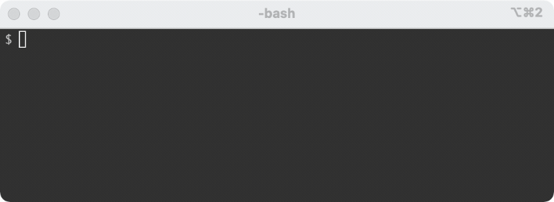
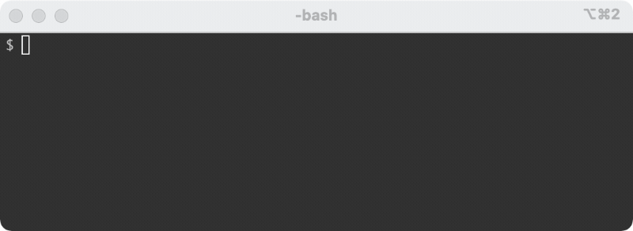
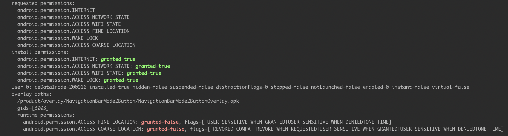

# ADB Extensions (ADBX)

ADB commands are not always intuitive. They are also not easy to remember. There is also a lot of bad advice out there. ADBX hopes to solve that.


## Objectives

* Tab completion

	

* Command discovery:

	

* Package validation

		
	
* Combine common operations into single commands
* Duplicate behavior on all connected devices. No more "more than one device found"
* Detecting rooted devices. Some operations can't be performed on non-rooted devices. We'll detect that before running commands
* Encapsulating best practices. There are lots of hacky, half-correct suggestions floating around the internet.


## Progress

| feature | complete |
|:---|:---:|
| tab completion |X|
| command discovery | X |
| package validation | X |
| multiple devices | |
| detect rooted devices | |


## Commands

##### `$ ax add_wifi SSID PASSWORD`

Setup wifi connection. This downloads, installs, and runs [adb-join-wifi](https://github.com/steinwurf/adb-join-wifi)

##### `$ ax list_packages`

List all installed packages (system and non-system)

##### `$ ax max_bright`
	
Set screen to maximum brightness


##### `$ ax permissions PACKAGE`
	
List entire `dumpsys` for a package, with highlighting for <span style="color:green">granted</span> and <span style="color:red">not granted</span> permissions:



##### `$ ax reboot`

Reboot device

##### `$ ax settings_app`

Launch system Settings app

##### `$ ax uninstall_package PACKAGE_NAME`

Uninstalls package by name

## Setup

These scripts run as ruby commands. Install latest ruby 2.7.1 + 

## Setup tab completion


ADBX relies on Bash Completion 2. Read more about why [here](https://itnext.io/programmable-completion-for-bash-on-macos-f81a0103080b)

#### MacOS pre-steps

1. update to latest Bash (4+): [directions here](https://medium.com/@weibeld/upgrading-bash-on-macos-7138bd1066ba)
2. install `bash-complete@2` [read more](https://itnext.io/programmable-completion-for-bash-on-macos-f81a0103080b)

```
$ brew install bash-completion@2
```

3. update `~/.bashrc` by adding

```
export BASH_COMPLETION_COMPAT_DIR="/usr/local/etc/bash_completion.d"
[[ -r "/usr/local/etc/profile.d/bash_completion.sh" ]] && . "/usr/local/etc/profile.d/bash_completion.sh"
```

#### for all machines

1. source both `ax` command and completion script. Add to `~/.bashrc`:

```
export PATH=$PATH:path/to/ADBX
source path/to/ADBX/ax_completion.bash
```

2. open new terminal window
3. `$ ax [TAB]`
4. see list of completable actions
